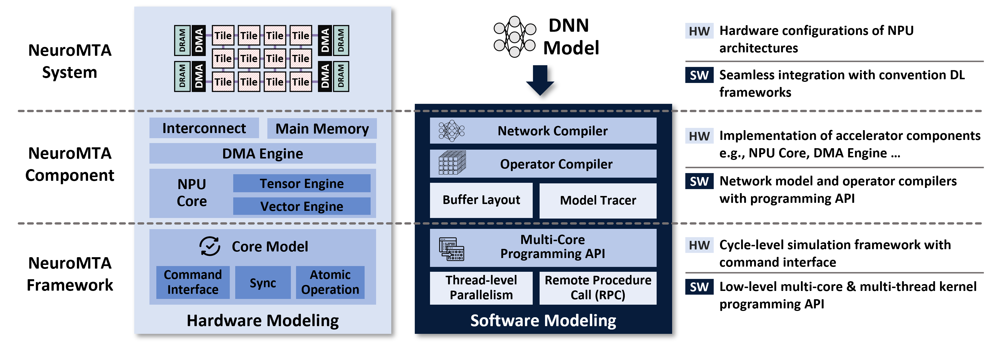

# NeuroMTA Simulator

<p align="center">

</p>


## Introduction

NeuroMTA is a highly programmable cycle-level multi-tile deep learning accelerator simulator. This simulator provides a fundamental framework to implement various multi-tile accelerator architectures and programming API to create test workload with inter-core spatial dataflow. The simulator is implemented as a Python library and easy to be extended by the hardware and software developers. 

## Installation

### NeuroMTA Simulator

```bash
conda create -n neuromta python=3.11    # python >= 3.11
conda activate neuromta
pip install -r requirements.txt

# install pytorch with CPU backend (unnecessary if PyTorch is already installed)
pip install torch torchvision --index-url https://download.pytorch.org/whl/cpu

# install NeuroMTA simulator
pip install -e .
```

### NeuroMTA Simulator Extension Modules

```bash
# Initialize submodules
git submodule update --init --recursive
conda activate neuromta
pip install cython  # extension modules are built upon Cython!

# Install PyBookSim (python extension of booksim2)
sudo apt update
sudo apt install flex bison           # BookSim2 dependency
pip install ./externals/pybooksim2    # pybooksim2 (cycle-level NoC simulator)

# Install PyDRAMSim (python extension of dramsim3)
pip install ./externals/pydramsim3    # pydramsim3 (cycle-level DRAM simulator)
```

### NeuroMTA Monitor (optional)

```bash
git clone https://github.com/SKKU-COMPASSLAB/NeuroMTA-Monitor.git ./externals/neuromta_monitor
pip install ./externals/neuromta_monitor
```

## Quick Start

NeuroMTA simulator provides a CLI console to make users easily manage simulation. Run `neuromta_runner` command to run the console! See this [tutorial](docs/tutorials/runner/1_quick_start.md) to understand how to use the NeuroMTA Runner!

```
$ neuromta_runner 

>>> help
list [model|device]
    (neuromta) Lists all available models and devices.

open_repo [model|device] <path>
    (neuromta) Opens a directory storing model or device presets.

open_session <device_name> <model_name> (n_workers)
    (neuromta) Opens a new session with the specified model and device presets.

close_session 
    (neuromta) Closes the currently open session.

set_session_recipe <recipe_option> <value>
    (neuromta) Changes the session's device recipe parameter.

set_core_group_shape <dim1> (dim2)
    (neuromta) Changes the session's core group shape.

set_core_group_offset <offset1> (offset2)
    (neuromta) Changes the session's core group offset.

enable_monitoring 
    (neuromta) Enables session monitoring during graph execution.

enable_profiler <path>
    (neuromta) Enables detailed profiling during graph execution.

compile_graph 
    (neuromta) Compiles the model on the device and prepares for execution.

run_graph 
    (neuromta) Runs the compiled graph.

help 
    (app) Shows this help message.

exit 
    (app) Exits the NeuroMTA Runner.
```

You can run simulation with the predefined device and model presets by simply typing all those commands to the CLI prompt window. Also, you can write a simulation recipe to automate all the simulation process. Example scripts are provided in `scripts/runner` directory, and you can run these scripts by using `-s` option.

```bash
neuromta_runner -s ./scripts/runner/s1_mnist.tcl
```

## Simulator Architecture

### NeuroMTA Framework

NeuroMTA simulator provides a comprehensive framework `neuromta.framework` to implement behavioral and cycle-level model of the deep learning accelerator. The framework includes several metaclasses to create cores, memory space, and device instances. You can create your own cores and hardware components by defining command-level interface of them.

### NeuroMTA Component

NeuroMTA simulator provides `neuromta.component`, which contains the actual implementation of predetermined hardware architectures including multi-tile accelerator. You can check details of each hardware architecture including NPU core, MXU (Matrix Multiplication Unit) and DMA (Direct Memory Access) engines. In this subproject, you can see several softwares that determines the memory layout of the tensors, dynamically maps tiled operators to each NPU core, and compiled DNN operator considering the on-chip memory usage and data transfer between NPU and DMA cores.

### NeuroMTA System

NeuroMTA simulator provides `neuromta.system`, which contains the preset of the commercial NPU architectures.

## Tutorials

### NeuroMTA Runner

1) [Quick Start with NeuroMTA Runner](docs/tutorials/runner/1_quick_start.md)
2) [Customizing Device and Model Presets](docs/tutorials/runner/2_customizing_presets.md)

### NeuroMTA Component

#### API Introduction
1) [Introduction](docs/tutorials/component/1_introduction.md)
2) [Core API](docs/tutorials/component/2_1_core_api.md)
3) [Device API](docs/tutorials/component/2_2_device_api.md)
4) [Tensor Buffer API](docs/tutorials/component/2_3_tensor_buffer_api.md)
5) [Operator API](docs/tutorials/component/2_4_operator_api.md)

#### Tutorials
1) [Operator and Network Tutorials](docs/tutorials/component/3_component_tutorials.md)

## Citation

Please cite the following [paper](https://ieeexplore.ieee.org/abstract/document/11617314).

```
@article{kim2026neuromta,
  title={NeuroMTA: Programmable Simulation Framework for Multi-Tile NPU Architectures},
  author={Kim, Seongwook and Hong, Seokin},
  journal={IEEE Computer Architecture Letters},
  year={2026},
  publisher={IEEE}
}
```